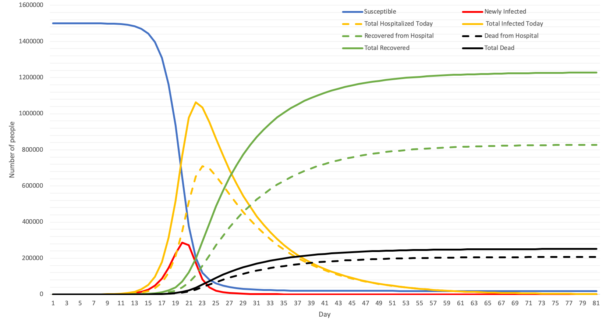

```{r setup, include=FALSE}
knitr::opts_chunk$set(echo = FALSE, message = FALSE, warning = FALSE)
library(dplyr)
library(ggplot2)
```

## 1. Model Introduction

The following model is developed from SIR-type compartmental models for COVID-19, including hospitalization as an intervention strategy. Contrary to basic SIR model in which the whole population is considered susceptible, the proposed deterministic model takes into account the fact that only certain percentage of the population being susceptible to get the disease. 

### Compartments

This model is proposed to trace epidemic evolution in an isolated population of $N$ individuals. At each moment of time (day), the population could be divided into five states (compartments):

* **Susceptible $(S)$**: currently at risk of getting the disease
* **Newly Infected $(I)$**: currently infected and infectious (being able to transmit the disease)
* **Hospitalized $(H)$**: currently infected and in critical conditions but no longer infectious.  (beingisolated in hospital)
* **Non-Hospitalized $(NH)$**: Still infected but not in the hospital so is still infectious
* **Recovered $(R)$**: was infected but successfully recovered (no matter if hospitalized or not), and isnow immune from the disease (transferred to the Non-Susceptible group).
* **Dead $(D)$**: difference between Infected and Recovered (I−R) i.e.  was infected but failed to recover.

Note that there is one additional end state that recovered people will be counted in:

* **Non-Susceptible $(NS)$**: either successfully recovered or initially at no risk of getting infected.

### Assumptions

The model is built upon several assumptions:

* Hospitalized individuals can no longer spread the disease. This follows that individuals once hos-pitalized are isolated from the community. For Non-hospitalized individuals, we will assume thatthey still spread the disease, but at a lower rate than that of newely infected individuals.
* Immunity from the disease is achieved and becomes permanent upon recovery, which makesRanabsorbing state. This means once recovered, an individual can no longer be susceptible (and thusmoved intoNSstate). This assumption can be made as we have only literature finds the rate ofre-infection to be negligible.
* The next day from being infected, a percentage of individuals will be placed into the hospital.
* Once becoming hospitalized or not hospitalized,  individuals will leave the compartment at someaverage rate. Afterwards, they will have either recovered or died.

### Parameters

At the beginning of the disease, we will have an initial number of people susceptible to the diseaseand a initial number of people infected with the disease.  Therefore, the compartments at $t= 0$ are:
* $S_0, I_0 > 0$
* $NS_0 \geq 0$
* $H_0 = R_0 = D_0 = {NH}_0 = 0$

The compartmentalization of the population are governed by a set of parameters:

* **Transmission rate $\beta$**: the infection rate (The probability of an infection from a single contact multiplied by the average amount of contacts per person).
* **Hospitalization percentage $\varepsilon$**: the  percentage ofinfected individuals that will endup  being hospitalized.
* **Hospitalized removal rate $\psi$**: The rate at which people will leave the hospital.  The inverse ofthis parameter represents the average time spent in the hospital.
* **Non-hospitalized removal rate $\lambda$**: The rate at which people will leave the hospital.The inverse of  this parameter represents the average amount  of  time  an  infected  individual  remains  infectedand infective before moving to the next stage (recover or die).
* **Recovery percentage without hospitalization $\gamma$**: The percentage of non-hospitalized infectedpeople who recovered from the disease. **$1-\gamma$** is the percentage of people who will die after not being hospitalized.
* **Recovery percentage with hospitalization $\theta$**: the percentage chance that an individual has ofbecoming fully recovered after being hospitalized. **$1-\theta$** is the percentage of people who will die after being hospitalized.

<center>

{width=70%}

</center>

### Mathematical Equations

Taking into consideration our 5 compartments, the model is described by a set of equations:

\begin{align*}
    \Delta{S_t} & =  - \frac{\beta S_{t-1}}{N} (I_{t-1} + \textit{NH}_{t-1}) \\
    \Delta{I_t} & = \frac{\beta S_{t-1}}{N}I_{t-1} - I_{t-1}  \\ 
    \Delta{H_{t}} & = \varepsilon*I_{t-1} - \psi H_{t-1} \\
    \Delta{NH_{t}} & = (1-\varepsilon)I_{t-1} - \lambda \textit{NH}_{t-1} \\
    \Delta{R_{t}} & = \lambda \gamma \textit{NH}_{t-1} + \psi \theta H_{t-1} \\
    \Delta{D_{t}} & = \lambda (1 - \gamma) \textit{NH}_{t-1} + \psi (1 - \theta) H_{t-1}
\end{align*}

Notice that $\Delta{S_t} + \Delta I_{t} + \Delta {H_{t}} + \Delta {NH_{t}} + \Delta {R_{t}} + \Delta {D_{t}} = 0$ which means no person will leave or be added to the system.

Moreover, $S_t + I_t + H_t + H_t + NH_t + NS_t + D_t = P$ (Note: $NS$ includes people who have recovered and who were initially non-susceptible.)

```{r}
model.data = function(N, beta, I.0, p, epsilon, theta, gamma, TimeH, TimeNH){
  I.rate = beta/N
  psi = 1/TimeH
  lambda = 1/TimeNH
  curr.day = 0
  S = p * N - I.0
  NS.0 = N - S - I.0
  NS = NS.0
  NewInfected = I.0
  Total.Hospital = 0
  Total.NonHospital = 0
  Total.Infected = NewInfected + Total.Hospital + Total.NonHospital
  Total.Infective = NewInfected + Total.NonHospital
  Hospital.Recovered = 0
  NonHospital.Recovered = 0
  Hospital.Dead = 0
  NonHospital.Dead = 0
  Total.Recovered = Hospital.Recovered + NonHospital.Recovered
  Total.Dead = Hospital.Dead + NonHospital.Dead
  Pop = S + NS + Total.Infected + Total.Dead
  Leaving.Hospital = 0
  Leaving.NonHospital = 0
  Recovered.Hospital.today = 0
  Recovered.NonHospital.today = 0
  Entering.Hospital = 0
  
  # If you want a full table like the excel, uncomment all lines in the df below
  df = data_frame(Day = curr.day,
                  Susceptible = S,
                  Non.Susceptible = NS,
                  Daily.New.Case = NewInfected,
                  Total.In.Hospital = Total.Hospital,
                  # Total.NonHospital = Total.NonHospital,
                  Infected = Total.Infected,
                  # Total.Infective = Total.Infective,
                  # Recovered.In.Hospital = Hospital.Recovered,
                  # Dead.In.Hospital = Hospital.Dead,
                  Total.Recovered = Total.Recovered,
                  Total.Dead = Total.Dead)
  
  # Watch the disease until it ends (daily new case = 0) or at max 200 days
  while(Total.Infected > 0 & curr.day < 1000){
    curr.day = curr.day + 1
    
    # Number of individuals recovered from the infected in hospital (previous day)
    # First need to see how many are leaving the hospital
    Leaving.Hospital = rbinom(1, Total.Hospital, psi)
    # Then how many of those recovered
    Recovered.Hospital.today = rbinom(1, Leaving.Hospital, theta)
    Hospital.Recovered = Hospital.Recovered + Recovered.Hospital.today
    Hospital.Dead = Hospital.Dead + Leaving.Hospital - Recovered.Hospital.today
    
    # Number of individuals dead from the infected in hospital (previous day)
    # First need to see how many not in hospital are getting over disease
    NonHospital.leaving = rbinom(1, Total.NonHospital, lambda)
    # How many of those are recovering
    Recovered.NonHospital.today = rbinom(1, NonHospital.leaving, gamma)
    NonHospital.Recovered = NonHospital.Recovered + Recovered.NonHospital.today
    NonHospital.Dead = NonHospital.Dead + NonHospital.leaving - Recovered.NonHospital.today
    
    # Total number of recovered or dead so far (cumulative)
    Total.Recovered = Hospital.Recovered + NonHospital.Recovered
    Total.Dead = Hospital.Dead + NonHospital.Dead
    
    # Number of individuals hospitalized from the infected in the previous day
    Entering.Hospital = rbinom(1, NewInfected, epsilon)
    Total.Hospital =  Entering.Hospital + Total.Hospital - Leaving.Hospital
    Total.NonHospital = NewInfected + Total.NonHospital - Entering.Hospital - NonHospital.leaving
    
    # Newly infected case today and total actively infected so far
    NewInfected = min(S, rbinom(1, S * Total.Infective, I.rate))
    Total.Infected = NewInfected + Total.Hospital + Total.NonHospital
    
    # Susceptible population left
    S = S - NewInfected
    
    # Current non-susceptible group
    NS = NS.0 + Total.Recovered
    
    # Infective group that can spread the disease the next day
    Total.Infective = NewInfected + Total.NonHospital
    
    # Confirm population
    Pop = S + NS + Total.Infected + Total.Dead
    
    # If you want a full table like the excel, uncomment this
    # data = c(curr.day, S, NS, NewInfected, Total.Hospital, Total.NonHospital, Total.Infected, Total.Infective, Hospital.Recovered, Hospital.Dead, Total.Recovered, Total.Dead, Pop)
    data = c(curr.day, S, NS, NewInfected, Total.Hospital, Total.Infected, Total.Recovered, Total.Dead)
    df = rbind(df, data)
  }
  return(df)
}
model.plot = function(data){
  p = ggplot(data  = data, aes(x = Day)) +
        geom_line(aes(y = Susceptible, color = "Susceptible")) +
        geom_line(aes(y = Daily.New.Case, color = "Daily New Case")) +
        geom_line(aes(y = Infected, color = "Infected")) +
        geom_line(aes(y = Total.In.Hospital, color = "Currently In Hospital")) +
        geom_line(aes(y = Total.Recovered, color = "Total Recoverd")) +
        geom_line(aes(y = Total.Dead, color = "Total Dead")) +
        scale_color_discrete(name = "Compartment") +
        labs(y = "Population", title = "SIRHD Model") + 
        theme_minimal()
  return(p)
}
model.info = function(data){
  Last.Day = nrow(data)
  Status = ifelse(data[Last.Day,]$Daily.New.Case == 0, "Ended", "Going")
  Total.Death = data[Last.Day,]$Total.Dead
  Total.Infected = sum(data$Daily.New.Case)
  Max.New.Case = max(data$Daily.New.Case)
  Peak.Day.New.Case = data[data$Daily.New.Case == Max.New.Case,]$Day
  Max.In.Hospital = max(data$Total.In.Hospital)
  Peak.Day.Hospital= data[data$Total.In.Hospital == Max.In.Hospital,]$Day
  info = c(Last.Day, Status, Total.Death, Total.Infected, Max.New.Case, Peak.Day.New.Case, Max.In.Hospital, Peak.Day.Hospital)
  return(info)
}
# Confirm the model by calculating that all compartments sum to population at any day
model.confirm = function(data){
  data$Pop = data$S + data$NS + data$Total.Infected + data$Total.Dead
  return(data)
}
SIRHD.model = function(N, beta, I.0, p, epsilon, theta, gamma, TimeH, TimeNH){
  param = c(N, beta, epsilon, theta, gamma, TimeH, TimeNH)
  data = model.data(N, beta, I.0, p, epsilon, theta, gamma, TimeH, TimeNH)
  plot = model.plot(data)
  result_info = model.info(data)
  info = c(param, result_info)
  return(list(data,plot,info))
}

# Helper function for string wrapping. 
# Default 20 character target width.
swr = function(string, nwrap=12) {
  paste(strwrap(string, width=nwrap), collapse="\n")
}
swr = Vectorize(swr)

test.model = SIRHD.model(3500, 4, 5, 0.5, 0.15, 0.9, 0.9, 10, 5)
test.model
```

### Example

Below is an example of a model on 10000 population with a tranmission rate = 2/10000, 5 initial infected inidividual, 50% susceptible rate, 20% hospitalization rate, recovery rate for both hospitalized and non-hospitalized individuals are 90%, time spend in hospital is 10 days, and infectious time (non-hospitalized) is 5 days.

```{r}
# N, beta, I.0, p, epsilon, theta, gamma, TimeH, TimeNH
test.model = SIRHD.model(3000000, 1, 5, 0.5, 0.7, 0.9, 0.8, 10, 5)
test.model[[1]]
test.model[[2]]
model.summary = cbind(c("Population", "Beta", "HospitalizationRate", "HospitalizedRecoveryRate", "NonHospitalizedRecoveryRate", "HospitalizationTime", "InfectionTime"), test.model[[3]][1:7], c("LastDay", "Status", "TotalDeath", "TotalInfected", "MaxNewCase", "PeakDayNewCase", "MaxInHospital", "PeakDayHospital"), test.model[[3]][8:15])
model.summary = as.data.frame(model.summary)
colnames(model.summary) = c("Parameter", "Value", "Result", "Value")
model.summary
```

### Iowa State Experiments

Applying this model to the state of Iowa, which has a population of roughly 3 million ($N = 3,000,000$), with a susceptible group of 1,499,995 ($p = 0.5$) with 5 being initially infected  (i.e the beginning of the disease). We use the per capita transmission rate of 3 over the total population ($\beta = 0.000001$), hospitalization percentage of 70\% ($\varepsilon = 0.7$), a recovery rate of 90\% ($\gamma = 0.9$) for infected individual not being hospitalized, and 80\% ($\theta = 0.8$) for people in hospitalization. We assume that everyday around 10\% of the infected group in the hospital the previous day will either recover or die ($\psi = 0.1$). For people not hospitalized, we'll have 20\% ($\lambda = 0.2$) either recover or die. 

Before getting detected and hospitalized, the 5 initial infected had spread the disease to $5 \times 0.000001 \times 1,499,995 = 7$ other people. On the first day, there are $1,499,995 - 7 = 1,499,988$ people left in the susceptible group, $5 \times 0.8 = 4$ infected people in the hospital and $7 + 5 - 4 = 8$ infected and infective people in the community. The total number of infected individuals is $8 + 4 = 12$, but only 8 people will be the source of transmission for the second day.

At the end of the first day, for the new 7 cases, $7 \times 0.8 = 5$ will be admitted to the hospital, increasing the total number of hospitalized individuals to $4 + 5 = 9$, and $12 - 9 = 3$ remained infected in the community. On the second day, $8 \times 0.000001 \times 1,499,988 = 12$ people are newly infected with the disease, leaving $1,499,988 - 12 = 1,499,976$ in the susceptible group. The total number of infected at this point is $12 + 12 = 24$, but only $12 + 3 = 15$ people will be the source of transmission for the second day. This model examines the disease for 81 days before it reaches equilibrium state, newly infected = 0.




## 2. Factorial Experiment Design 

### Response Variables
+ Total Death Proportion
+ Total Infected Proportion
+ Number of Days (disease lasts)
+ Peak Prevalence (Max Infected Proportion)
+ Max Hospitalized Proportion
  
  
### Explanatory Variables of 7 factors with 288 levels
+ Population $N$
  * small town - 10,000
  * big town - 100,000
  * mega city - 1,000,000
+ Transmission Rate $\beta$
  * $1$
  * $2$
  * $4$
+ Hospitalization Rate $\varepsilon$
  * 5\%
  * 10\%
  * 15\%
+ Recovery Rate with Hospitalization $\theta$
  * 90%
  * 95%
+ Recovery Rate without Hospitalization $\gamma$
  * 90%
  * 95%
+ Average time in hospital ${\psi}^{-1}$
  * 5 days
  * 10 days
+ Average time in infected status ${\lambda}^{-1}$
  * 1 day
  * 5 days

```{r}
I.0 = 5
S.rate = 0.5

# List of Explanatory Variables:
Pop.Lst = c(10000, 100000, 1000000)
Beta.Lst = c(2,4)
Hrate.Lst = c(0.05, 0.1, 0.15)
RrateH.Lst = c(0.9, 0.95)
RrateNH.Lst = c(0.9, 0.95)
TimeH.Lst = c(10, 15)
TimeNH.Lst = c(1, 5)

#Pop.Lst, Beta.Lst, Hrate.Lst, RrateH.Lst, RrateNH.Lst, TimeH.Lst, TimeNH.Lst
result_table = data.frame()

# Run 10 simulations of every 288 combinations
sims = 10
for(i in 1:sims){
  for(N in Pop.Lst){
    for(b in Beta.Lst){
      for(hr in Hrate.Lst){
        for(rrh in RrateH.Lst){
          for(rrnh in RrateNH.Lst){
            for(th in TimeH.Lst){
              for(tnh in TimeNH.Lst){
                model = SIRHD.model(N, b, I.0, S.rate, hr, rrh, rrnh, th, tnh)
                result_table = rbind(result_table, model[[3]], stringsAsFactors = FALSE)
              }
            }
          }
        }
      }
    }
  }
}

colnames(result_table) = c("Population", "Beta", "HospitalizationRate", "HospitalizedRecoveryRate", "NonHospitalizedRecoveryRate", "HospitalizationTime", "InfectionTime", "LastDay", "Status", "TotalDeath", "TotalInfected", "MaxNewCase", "PeakDayNewCase", "MaxInHospital", "PeakDayHospital")
result_table[1:7] = as.data.frame(sapply(result_table[1:7], as.numeric))
result_table[1:7] = format(result_table[1:7], scientific = FALSE)
result_table[c(1:7,9)] = as.data.frame(sapply(result_table[c(1:7,9)], as.factor))
result_table[c(8,10:15)] = as.data.frame(sapply(result_table[c(8,10:15)], as.numeric))

numericPop = as.numeric(as.character(result_table$Population))

result_table$DeathProportion = result_table$TotalDeath / numericPop
result_table$InfectedProportion = result_table$TotalInfected / numericPop
result_table$MaxCaseProportion = result_table$MaxNewCase / numericPop
result_table$MaxHospitalProportion = result_table$MaxInHospital / numericPop
result_table
```

#### Response Variable: Total Death Proportion

##### ANOVA result

```{r}
# Full model without interaction
Death.Anova = aov(DeathProportion ~ Population + Beta + HospitalizationRate + HospitalizedRecoveryRate + NonHospitalizedRecoveryRate + HospitalizationTime + InfectionTime, data = result_table) 
summary(Death.Anova)

# Reduced model with interaction between significant variables from full model
Death.Anova1 = aov(DeathProportion ~ Beta + HospitalizationRate + HospitalizedRecoveryRate + NonHospitalizedRecoveryRate + InfectionTime
                   + Beta*HospitalizationRate + Beta*HospitalizedRecoveryRate + Beta*NonHospitalizedRecoveryRate + Beta*InfectionTime 
                   + HospitalizationRate*HospitalizedRecoveryRate + HospitalizationRate*NonHospitalizedRecoveryRate + HospitalizationRate*InfectionTime +
                   + HospitalizedRecoveryRate*NonHospitalizedRecoveryRate + HospitalizedRecoveryRate*InfectionTime 
                   + NonHospitalizedRecoveryRate*InfectionTime, 
                   data = result_table)
summary(Death.Anova1)
```

```{r}
# Summarize main effects of each significant variable
avg.Beta = result_table %>% group_by(Beta) %>% summarise(Average.Death.Proportion = mean(DeathProportion))
avg.HospitalizationRate = result_table %>% group_by(HospitalizationRate) %>% summarise(Average.Death.Proportion = mean(DeathProportion))
avg.HospitalizedRecoveryRate = result_table %>% group_by(HospitalizedRecoveryRate) %>% summarise(Average.Death.Proportion = mean(DeathProportion))
avg.NonHospitalizedRecoveryRate = result_table %>% group_by(NonHospitalizedRecoveryRate) %>% summarise(Average.Death.Proportion = mean(DeathProportion))
avg.InfectionTime = result_table %>% group_by(InfectionTime) %>% summarise(Average.Death.Proportion = mean(DeathProportion))

avg.Beta$Var = "Beta"
names(avg.Beta) = c("Level", "Average.Death.Proportion", "Var")

avg.HospitalizationRate$Var = "Hospitalization Rate"
names(avg.HospitalizationRate) = c("Level", "Average.Death.Proportion", "Var")

avg.HospitalizedRecoveryRate$Var = "Hospitalized Recovery Rate"
names(avg.HospitalizedRecoveryRate) = c("Level", "Average.Death.Proportion", "Var")

avg.NonHospitalizedRecoveryRate$Var = "Non-Hospitalized Recovery Rate"
names(avg.NonHospitalizedRecoveryRate) = c("Level", "Average.Death.Proportion", "Var")

avg.InfectionTime$Var = "Quarantine"
names(avg.InfectionTime) = c("Level", "Average.Death.Proportion", "Var")
avg.InfectionTime$Level = ifelse(avg.InfectionTime$Level == "1", "yes", "no")

avg.all = rbind(avg.Beta, avg.HospitalizationRate, avg.InfectionTime, avg.HospitalizedRecoveryRate, avg.NonHospitalizedRecoveryRate)
# Main Effect Plots
ann_text <- tribble(
  ~Var, ~Average.Death.Proportion, ~Level,
  #--|--|--
  "Beta", 0.037, "2")
avg.all$Var = swr(avg.all$Var, 20)
ggplot(avg.all, aes(x = Level, y = Average.Death.Proportion, group = Var)) + 
  facet_grid(cols = vars(Var), scales = "free_x") + 
  theme_bw() + 
  labs(y = "Average Total Death Proportion", x = "Variable Level") + 
  geom_hline(yintercept = mean(result_table$DeathProportion), linetype='dashed', col = 'blue') + geom_line() +
  geom_point() + 
  geom_text(data = ann_text, label = swr("Grand Average", 5), colour = 'blue', size = 2.8)
```

```{r}
# Summarize interaction effects by all combinations of significant variables
DeathSummary = result_table %>% group_by(Beta, HospitalizationRate, HospitalizedRecoveryRate, NonHospitalizedRecoveryRate, InfectionTime) %>% summarise(Average.Death.Proportion = mean(DeathProportion))

# New facet label names for variables
InfectionTime.labs <- c("With quarantine", "Without quarantine")
names(InfectionTime.labs) <- c("1", "5")

Beta.labs <- c("Beta = 2", "Beta = 4")
names(Beta.labs) <- c("2", "4")

HospitalizationRate.labs <- c("5% Hospitalization", "10% Hospitalization", "15% Hospitalization")
names(HospitalizationRate.labs) <- c("0.05", "0.10", "0.15")

DeathSummary$InfectionTime = ifelse(DeathSummary$InfectionTime == 1, "With quarantine", "Without quarantine")
DeathSummary$InfectionTime = swr(DeathSummary$InfectionTime)
# Interaction Plot
ggplot(DeathSummary, 
       aes(x = NonHospitalizedRecoveryRate, 
           y = Average.Death.Proportion,
           color = HospitalizedRecoveryRate,
           group = HospitalizedRecoveryRate)) +
  geom_point() + 
  geom_line() +
  facet_grid(InfectionTime ~ Beta + HospitalizationRate, labeller = labeller(Beta = Beta.labs, HospitalizationRate = swr(HospitalizationRate.labs))) +
  # geom_point(aes(color = HospitalizedRecoveryRate)) + 
  theme_bw() + 
  labs(y = "Average Total Death Proportion", 
       x = "Non-Hospitalized Recovery Rate",
       color = "Hospitalized Recovery Rate") +
  theme(legend.position="top")
```

#### Response Variable: Total Infected Proportion

##### ANOVA result

```{r}
# Full model without interaction
Infected.Anova = aov(InfectedProportion ~ Population + Beta + HospitalizationRate + HospitalizedRecoveryRate + NonHospitalizedRecoveryRate + HospitalizationTime + InfectionTime, data = result_table)
summary(Infected.Anova)

# Reduced model with interaction between significant variables from full model
Infected.Anova1 = aov(InfectedProportion ~ Beta + HospitalizationRate + InfectionTime 
                      + Beta*HospitalizationRate + Beta*InfectionTime + HospitalizationRate*InfectionTime, 
                      data = result_table)
summary(Infected.Anova1)
```

```{r}
# Summarize main effects of each significant variable
avg.Beta = result_table %>% group_by(Beta) %>% summarise(Average.Infected.Proportion = mean(InfectedProportion))
avg.InfectionTime = result_table %>% group_by(InfectionTime) %>% summarise(Average.Infected.Proportion = mean(InfectedProportion))
avg.HospitalizationRate = result_table %>% group_by(HospitalizationRate) %>% summarise(Average.Infected.Proportion = mean(InfectedProportion))

avg.Beta$Var = "Beta"
names(avg.Beta) = c("Level", "Average.Infected.Proportion", "Var")

avg.HospitalizationRate$Var = "Hospitalization Rate"
names(avg.HospitalizationRate) = c("Level", "Average.Infected.Proportion", "Var")

avg.InfectionTime$Var = "Quarantine"
names(avg.InfectionTime) = c("Level", "Average.Infected.Proportion", "Var")
avg.InfectionTime$Level = ifelse(avg.InfectionTime$Level == "1", "yes", "no")

avg.all = rbind(avg.Beta, avg.HospitalizationRate, avg.InfectionTime)
avg.all$Var = swr(avg.all$Var, 20)

# Main Effect Plots
ann_text <- tribble(
  ~Var, ~Average.Infected.Proportion, ~Level,
  #--|--|--
  "Beta", mean(result_table$InfectedProportion) + 0.004, "2")

ggplot(avg.all, aes(x = Level, y = Average.Infected.Proportion, group = Var)) + 
  facet_grid(cols = vars(Var), scales = "free_x") + 
  geom_line() +
  geom_point() + 
  theme_bw() + 
  labs(y = "Average Total Infected Proportion", x = "Variable Level") +
  geom_hline(yintercept = mean(result_table$InfectedProportion), linetype='dashed', col = 'blue') + 
  geom_text(data = ann_text, label = swr("Grand Average", 5), colour = 'blue', size = 3)
```

```{r}
# Summarize interaction effects by all combinations of significant variables
InfectedSummary = result_table %>% group_by(Beta, InfectionTime, HospitalizationRate) %>% summarise(Average.Infected.Proportion = mean(InfectedProportion))
InfectedSummary$InfectionTime = ifelse(InfectedSummary$InfectionTime == "1", "yes", "no")
InfectedSummary$InfectionTime = factor(InfectedSummary$InfectionTime, levels = c("yes", "no"), ordered = TRUE )

# Interaction Plot
ggplot(InfectedSummary, 
       aes(x = InfectionTime, 
           y = Average.Infected.Proportion, 
           group = Beta,
           color = Beta)) + 
  geom_line() +
  geom_point() + 
  facet_grid(~ HospitalizationRate, labeller = labeller(HospitalizationRate = HospitalizationRate.labs)) +
  theme_bw() + 
  labs(y = "Average Total Infected Proportion", 
       x = "Quarantine") +
  theme(legend.position="top")
```

#### Response Variable: Maximum New Case Proportion

##### ANOVA result

```{r}
NewCase.Anova = aov(MaxCaseProportion ~ Population + Beta + HospitalizationRate + HospitalizedRecoveryRate + NonHospitalizedRecoveryRate + HospitalizationTime + InfectionTime, data = result_table)
summary(NewCase.Anova)

NewCase.Anova1 = aov(MaxCaseProportion ~ Population + Beta + HospitalizationRate + InfectionTime +
                       Population*Beta + Population*HospitalizationRate + Population*InfectionTime + 
                       Beta*HospitalizationRate + Beta*InfectionTime + HospitalizationRate*InfectionTime, 
                     data = result_table)
summary(NewCase.Anova1)
```

```{r}
# Summarize main effects of each significant variable
avg.Population = result_table %>% group_by(Population) %>% summarise(Average.MaxCaseProportion = mean(MaxCaseProportion))
avg.Beta = result_table %>% group_by(Beta) %>% summarise(Average.MaxCaseProportion = mean(MaxCaseProportion))
avg.InfectionTime = result_table %>% group_by(InfectionTime) %>% summarise(Average.MaxCaseProportion = mean(MaxCaseProportion))
avg.HospitalizationRate = result_table %>% group_by(HospitalizationRate) %>% summarise(Average.MaxCaseProportion = mean(MaxCaseProportion))

avg.Population$Var = "Population"
names(avg.Population) = c("Level", "Average.MaxCaseProportion", "Var")

avg.Beta$Var = "Beta"
names(avg.Beta) = c("Level", "Average.MaxCaseProportion", "Var")

avg.HospitalizationRate$Var = "Hospitalization Rate"
names(avg.HospitalizationRate) = c("Level", "Average.MaxCaseProportion", "Var")

avg.InfectionTime$Var = "Quarantine"
names(avg.InfectionTime) = c("Level", "Average.MaxCaseProportion", "Var")
avg.InfectionTime$Level = ifelse(avg.InfectionTime$Level == "1", "yes", "no")

avg.all = rbind(avg.Population, avg.Beta, avg.HospitalizationRate, avg.InfectionTime)
avg.all$Var = swr(avg.all$Var, 20)

# Main Effect Plots
ann_text <- tribble(
  ~Var, ~Average.MaxCaseProportion, ~Level,
  #--|--|--
  "Beta", mean(result_table$MaxCaseProportion) + 0.007, "2")

ggplot(avg.all, aes(x = Level, y = Average.MaxCaseProportion, group = Var)) + 
  facet_grid(cols = vars(Var), scales = "free_x") + 
  geom_line() +
  geom_point() + 
  theme_bw() + 
  labs(y = "Average Maximum Daily New Case Proportion", x = "Variable Level") +
  geom_hline(yintercept = mean(result_table$MaxCaseProportion), linetype='dashed', col = 'blue') + 
  geom_text(data = ann_text, label = swr("Grand Average", 5), colour = 'blue', size = 3)
```

```{r}
# Summarize interaction effects by all combinations of significant variables
MaxCaseSummary = result_table %>% group_by(Population, Beta, InfectionTime, HospitalizationRate) %>% summarise(Average.MaxCaseProportion = mean(MaxCaseProportion))
MaxCaseSummary$InfectionTime = ifelse(MaxCaseSummary$InfectionTime == 1, "With quarantine", "Without quarantine")
# MaxCaseSummary$InfectionTime = factor(MaxCaseSummary$InfectionTime, levels = c("yes", "no"), ordered = TRUE )

# Interaction Plot
ggplot(MaxCaseSummary, 
       aes(x = Population, 
           y = Average.MaxCaseProportion, 
           group = Beta,
           color = Beta)) + 
  geom_line() +
  geom_point() + 
  facet_grid(InfectionTime ~ HospitalizationRate, labeller = labeller(HospitalizationRate = HospitalizationRate.labs)) +
  theme_bw() + 
  labs(y = "Average Maximum Daily New Case Proportion") +
  theme(legend.position="top")
```

#### Response Variable: Max Hospitalized Proportion

```{r}
Hospital.Anova = aov(MaxHospitalProportion ~ Population + Beta + HospitalizationRate + HospitalizedRecoveryRate + NonHospitalizedRecoveryRate + HospitalizationTime + InfectionTime, data = result_table)
summary(Hospital.Anova)

Hospital.Anova1 = aov(MaxHospitalProportion ~ Beta + HospitalizationRate + HospitalizationTime + InfectionTime
                      + Beta*HospitalizationRate + Beta*HospitalizationTime + Beta*InfectionTime
                      + HospitalizationRate*HospitalizationTime + HospitalizationRate*InfectionTime + HospitalizationTime*InfectionTime, 
                      data = result_table)
summary(Hospital.Anova1)
```


```{r}
# Summarize main effects of each significant variable
avg.Beta = result_table %>% group_by(Beta) %>% summarise(Average.MaxHospitalProportion = mean(MaxHospitalProportion))
avg.HospitalizationRate = result_table %>% group_by(HospitalizationRate) %>% summarise(Average.MaxHospitalProportion = mean(MaxHospitalProportion))
avg.HospitalizationTime = result_table %>% group_by(HospitalizationTime) %>% summarise(Average.MaxHospitalProportion = mean(MaxHospitalProportion))
avg.InfectionTime = result_table %>% group_by(InfectionTime) %>% summarise(Average.MaxHospitalProportion = mean(MaxHospitalProportion))

avg.Beta$Var = "Beta"
names(avg.Beta) = c("Level", "Average.MaxHospitalProportion", "Var")

avg.HospitalizationRate$Var = "Hospitalization Rate"
names(avg.HospitalizationRate) = c("Level", "Average.MaxHospitalProportion", "Var")

avg.HospitalizationTime$Var = "Hospitalization Time (days)"
names(avg.HospitalizationTime) = c("Level", "Average.MaxHospitalProportion", "Var")

avg.InfectionTime$Var = "Quarantine"
names(avg.InfectionTime) = c("Level", "Average.MaxHospitalProportion", "Var")
avg.InfectionTime$Level = ifelse(avg.InfectionTime$Level == "1", "yes", "no")

avg.all = rbind(avg.Beta, avg.HospitalizationRate, avg.InfectionTime, avg.HospitalizationTime)
avg.all$Var = swr(avg.all$Var, 20)

# Main Effect Plots
ann_text <- tribble(
  ~Var, ~Average.MaxHospitalProportion, ~Level,
  #--|--|--
  "Beta", mean(result_table$MaxHospitalProportion) + 0.003, "2")

ggplot(avg.all, aes(x = Level, y = Average.MaxHospitalProportion, group = Var)) + 
  facet_grid(cols = vars(Var), scales = "free_x") + 
  geom_line() +
  geom_point() + 
  theme_bw() + 
  labs(y = "Average Maximum Daily Hospitalization Proportion", x = "Variable Level") +
  geom_hline(yintercept = mean(result_table$MaxHospitalProportion), linetype='dashed', col = 'blue') + 
  geom_text(data = ann_text, label = swr("Grand Average", 5), colour = 'blue', size = 3)

# Summarize interaction effects by all combinations of significant variables
MaxHospitalSummary = result_table %>% group_by(Beta, InfectionTime, HospitalizationRate, HospitalizationTime) %>% summarise(Average.MaxHospitalProportion = mean(MaxHospitalProportion))
MaxHospitalSummary$InfectionTime = ifelse(MaxHospitalSummary$InfectionTime == 1, "With quarantine", "Without quarantine")

# Interaction Plot
ggplot(MaxHospitalSummary, 
       aes(x = HospitalizationTime, 
           y = Average.MaxHospitalProportion, 
           group = Beta,
           color = Beta)) + 
  geom_line() +
  geom_point() + 
  facet_grid(InfectionTime ~ HospitalizationRate, labeller = labeller(HospitalizationRate = HospitalizationRate.labs)) +
  theme_bw() + 
  labs(y = "Average Maximum Daily Hospitalization Proportion") +
  theme(legend.position="top")
```

#### Response Variable: Peak Day of Infected

```{r}
PeakDay.Anova = aov(PeakDayNewCase ~ Population + Beta + HospitalizationRate + HospitalizedRecoveryRate + NonHospitalizedRecoveryRate + HospitalizationTime + InfectionTime, data = result_table)
summary(PeakDay.Anova)
```

#### Response Variable: Peak Day of Hospitalization

```{r}
PeakDayH.Anova = aov(PeakDayHospital ~ Population + Beta + HospitalizationRate + HospitalizedRecoveryRate + NonHospitalizedRecoveryRate + HospitalizationTime + InfectionTime, data = result_table)
summary(PeakDayH.Anova)
```